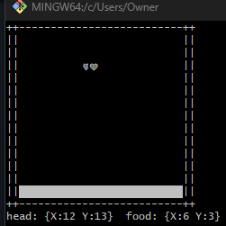

# go-snake-ssh

A terminal snake game written in Go. Runs locally, or as an SSH server that lets multiple players connect concurrently — each gets their own independent game.



## Why

A small project to learn Go end-to-end: goroutines, channels, `select`, `io.Reader`/`io.Writer` interfaces, ANSI escape codes, terminal raw mode, and the SSH server programming model.

The game logic is fully transport-agnostic — `game.Run(r io.Reader, w io.Writer, cfg Config) error` doesn't know whether it's talking to a local terminal or a remote SSH session. Each entry point (`cmd/snake-local`, `cmd/snake-ssh`) handles only its own setup concerns.

## Project layout

```
go-snake-ssh/
├── game/                 ← pure game logic, no I/O specifics
│   └── game.go
├── cmd/
│   ├── snake-local/      ← local terminal entry point
│   │   └── main.go
│   └── snake-ssh/        ← SSH server entry point
│       └── main.go
└── host_key              ← SSH host key (generate yourself; gitignored)
```

## Controls

| Key | Action |
| --- | --- |
| `W` / `A` / `S` / `D` | Move up / left / down / right |
| `Ctrl-C` | Quit |

The snake wraps around the borders. Eating a heart (`❤`) grows your length by one.

## Running locally

```sh
go run ./cmd/snake-local
```

The game auto-sizes to your terminal. Resize the window before launching for a bigger or smaller play field. Minimum size is roughly 24 cols × 9 rows.

## Running the SSH server

### 1. Generate a host key (one time)

```sh
ssh-keygen -t ed25519 -f host_key -N ""
```

This writes `host_key` (private) and `host_key.pub` (public) to the project root. Both are gitignored — never commit them.

### 2. Start the server

Either with `go run`:

```sh
go run ./cmd/snake-ssh
```

…or with Docker (recommended for actual hosting):

```sh
docker compose up -d --build
```

Either way, you'll see:

```
snake server on :2222
```

To watch logs / stop the dockerized server:

```sh
docker compose logs -f
docker compose down
```

### 3. Connect from another terminal

```sh
ssh -p 2222 yourname@localhost
```

The first time you connect, SSH will ask you to confirm the host key fingerprint. After that, reconnects are silent.

The server has **no authentication** — any username is accepted, and your username appears in the welcome banner. Multiple concurrent connections each get their own independent game.

## What's running where

| Concern | Local | SSH |
| --- | --- | --- |
| Terminal raw mode | Server program (`term.MakeRaw`) | Client's SSH session (handled by client) |
| Per-session game state | One game | One game per connection, in its own goroutine |
| Welcome banner | — | Yes |
| Press-any-key gate | — | Yes |
| Auto-size to terminal | Yes | Yes |
| Cursor hide/show on entry/exit | Yes | Yes |

## Notes for Windows users

If you're on Windows, prefer **PowerShell 7 in Windows Terminal** or **WSL2** over MINGW64 / git-bash. The latter wraps stdin as a pipe rather than exposing the real console handle, which causes some terminal queries to fail. The local entry point falls back to a default size (60×20) if it can't query the terminal — the game still runs, just at a fixed size.

## What's intentionally *not* here

- **Authentication.** Designed for a public toy server.
- **Persistent state / leaderboards.** Each game is independent.
- **Self-collision detection.** The snake currently passes through itself.
- **Graceful shutdown via `context.Context`.** The server runs until killed; in-flight games are cut at the connection layer when the process exits.

These are reasonable next features to add, not deliberate omissions for the design.

## Stack

- Go 1.26
- [`github.com/gliderlabs/ssh`](https://github.com/gliderlabs/ssh) — SSH server
- [`golang.org/x/term`](https://pkg.go.dev/golang.org/x/term) — terminal raw mode and size
- [`golang.org/x/crypto/ssh`](https://pkg.go.dev/golang.org/x/crypto/ssh) — host key parsing
- ANSI escape codes for rendering — no curses-style library

## License

Personal project, no license set. Take what's useful.
